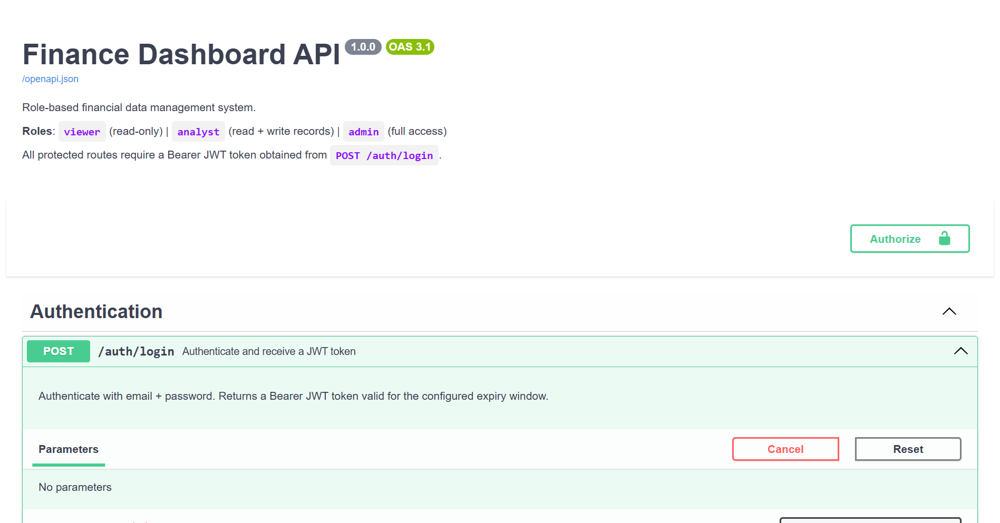
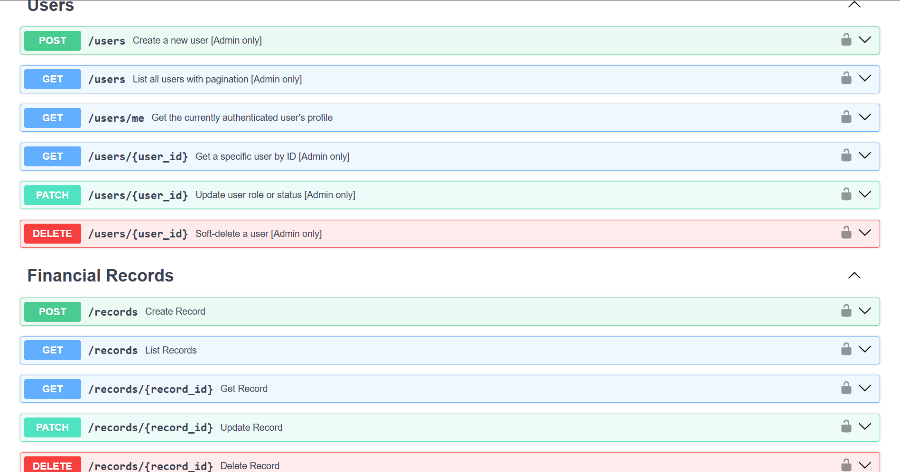
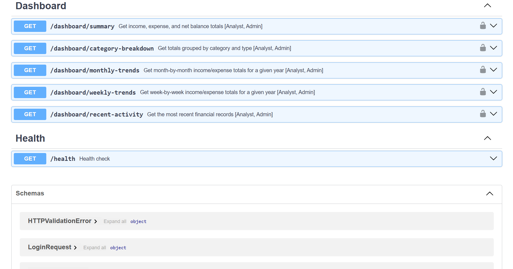
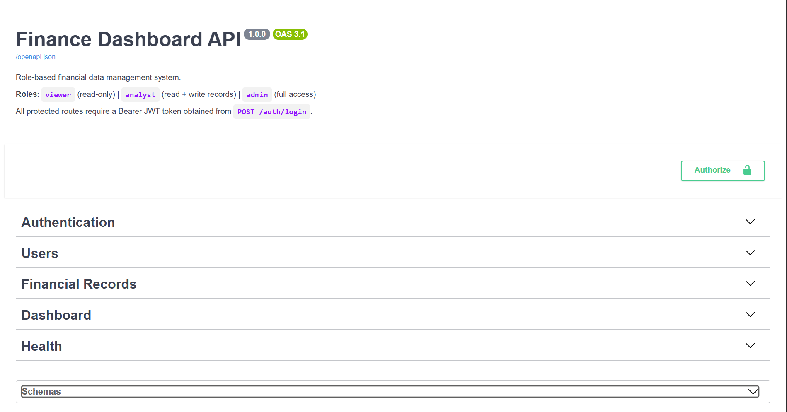
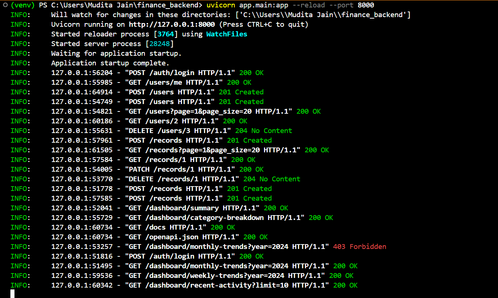

# 💰 Finance Dashboard API


A **production-ready backend system** built with FastAPI for managing financial records using:

* 🔐 JWT Authentication
* 👥 Role-Based Access Control (RBAC)
* 📊 Financial analytics dashboard
* ⚡ High-performance async API

---

# 📸 API Preview (Swagger UI)

### 🔐 Authentication



### 👤 Users API



### 💰 Records API



### 📊 Dashboard API



### 📊 Console Logs



---

# 🚀 Features

* Secure JWT-based authentication
* Role-based access (`viewer`, `analyst`, `admin`)
* CRUD operations for financial records
* Advanced filtering + pagination
* Dashboard analytics (monthly, weekly, category breakdown)
* Rate limiting (anti-abuse)
* Fully tested backend (pytest)

---

# 🛠️ Setup Guide

## 1️⃣ Clone Repo

```bash
git clone https://github.com/BeingMudita/finance_backend.git
cd finance-dashboard
```

---

## 2️⃣ Create Virtual Environment

```bash
python -m venv venv
venv\Scripts\activate
```

---

## 3️⃣ Install Dependencies

```bash
pip install -r requirements.txt
```

---

## 4️⃣ Fix bcrypt issue (IMPORTANT)

```bash
pip install bcrypt==4.0.1
```

---

## 5️⃣ Create `.env`

```env
SECRET_KEY=your-secret-key
ALGORITHM=HS256
ACCESS_TOKEN_EXPIRE_MINUTES=60

DATABASE_URL=sqlite:///./finance.db

FIRST_ADMIN_EMAIL=admin@example.com
FIRST_ADMIN_PASSWORD=Admin@123!

RATE_LIMIT_PER_MINUTE=60
```

---

## 6️⃣ Initialize Database

```bash
python init_db.py
```

---

## 7️⃣ Run Server

```bash
uvicorn app.main:app --reload
```

👉 Open:
http://127.0.0.1:8000/docs

---

# 🔐 How to Use the API (Step-by-Step)

---

## ✅ Step 1: Login

### Endpoint:

```http
POST /auth/login
```

### Request:

```json
{
  "email": "admin@example.com",
  "password": "Admin@123!"
}
```

### Response:

```json
{
  "access_token": "JWT_TOKEN",
  "token_type": "bearer"
}
```

---

## ✅ Step 2: Authorize

Click **Authorize 🔒** in Swagger and enter:

```bash
Bearer YOUR_TOKEN
```

---

# 👥 Users API (Admin Only)

---

## ➕ Create User

```http
POST /users
```

```json
{
  "email": "analyst@test.com",
  "full_name": "Test Analyst",
  "password": "Analyst@123",
  "role": "analyst"
}
```

---

## 📄 Get All Users

```http
GET /users
```

---

## 🙋 Get Current User

```http
GET /users/me
```

---

# 💰 Financial Records API

---

## ➕ Create Record

```http
POST /records
```

```json
{
  "amount": 5000,
  "record_type": "income",
  "category": "salary",
  "record_date": "2024-06-15",
  "description": "Monthly salary",
  "notes": "June income"
}
```

---

## 📄 List Records

```http
GET /records?page=1&page_size=10
```

---

## 🔍 Filter Records

```http
GET /records?record_type=income&date_from=2024-01-01&date_to=2024-12-31
```

---

## ✏️ Update Record

```http
PATCH /records/{id}
```

```json
{
  "amount": 6000,
  "description": "Updated salary"
}
```

---

## ❌ Delete Record

```http
DELETE /records/{id}
```

---

# 📊 Dashboard API

---

## 📈 Summary

```http
GET /dashboard/summary
```

---

## 📊 Category Breakdown

```http
GET /dashboard/category-breakdown
```

---

## 📅 Monthly Trends

```http
GET /dashboard/monthly-trends
```

---

## 📆 Weekly Trends

```http
GET /dashboard/weekly-trends
```

---

## 🕒 Recent Activity

```http
GET /dashboard/recent-activity
```

---

# 🧪 Testing

Run:

```bash
pytest
```

✔ Uses separate test DB
✔ Covers auth + records + dashboard

---

# 🧠 Roles Explained

| Role    | Access               |
| ------- | -------------------- |
| Viewer  | Read-only            |
| Analyst | Read + Write records |
| Admin   | Full control         |

---

# 🧭 How to Navigate Swagger UI (IMPORTANT)

1. Open `/docs`
2. Start with **POST /auth/login**
3. Copy token
4. Click **Authorize**
5. Test APIs in this order:

```text
Login → Users → Records → Dashboard
```

---

# ⚠️ Common Issues

---

## ❌ 422 Error (Email invalid)

Use:

```text
admin@example.com
```

---

## ❌ bcrypt error

```bash
pip install bcrypt==4.0.1
```

---

## ❌ DB not created

```bash
python init_db.py
```

---

# 🏗️ Architecture

```text
Client → FastAPI Routers → Services → Database
                     ↓
                 Security (JWT + RBAC)
```

---

# 🚀 Tech Stack

* FastAPI
* SQLAlchemy
* SQLite
* Pydantic
* JWT (python-jose)
* Passlib (bcrypt)
* Pytest

---

# 👩‍💻 Author

**Mudita Jain**

---

# 🌟 Final Note

This project demonstrates:

* Clean architecture
* Secure authentication
* Scalable backend design

